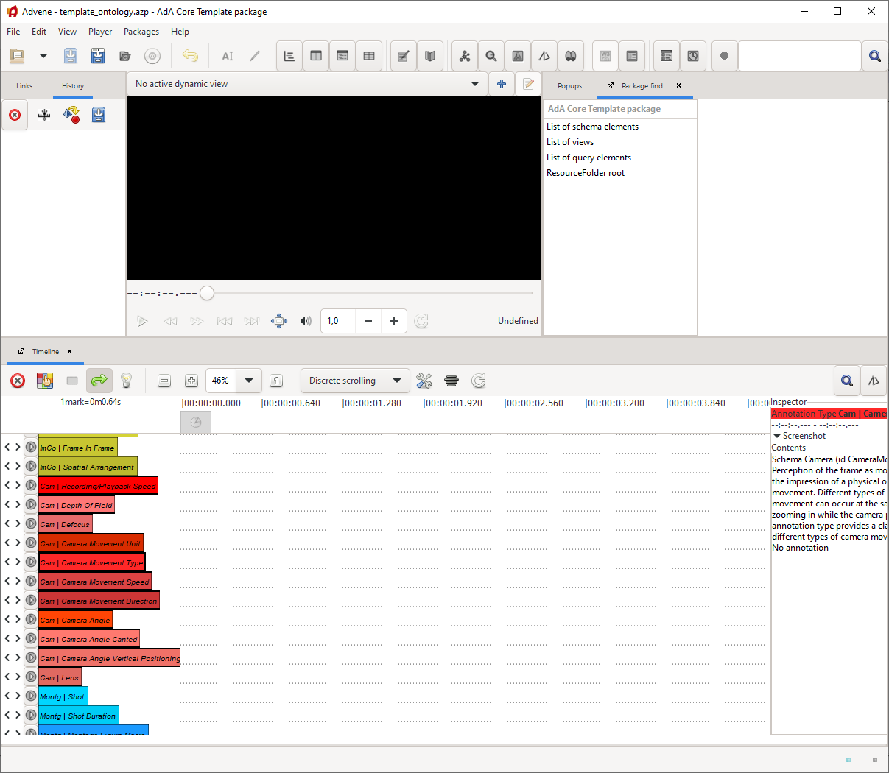

# Advene AdA Filmontology Template

This folder contains an Advene template package (**template_ontology.azp**) that allows you to annotate audiovisual content using the AdA Filmontology's predefined annotation types and values. It contains the imported ontology with its 8 annotation levels, 78 annotation types and 502 annotation values. 

## How to use the template

Normally, the ontology template is not used directly, instead a film-specific template can be downloaded from the [AdA video analysis back end](https://github.com/ProjectAdA/ada-va) once a new movie was ingested.

The following steps must be taken in order to use the template manually:
* Open template_ontology.azp in Advene
* Save as movie.azp
* File --> Associate a video file... (use the movie to annotate)
* Player --> Display media information (note down duration in ms)
* Player --> Verify video checksum --> Store in package
* View --> Package finder --> AdA Core Template package --> Metadata (note down media checksum)
* Edit --> Package Properties...
	* Enter title, descripton
	* Enter duration (ms) from media information
	* Enter Media URI http://ada.cinepoetics.org/resource/media/checksum (checksum from Metadata)
	* Uncheck "Template Package"
* Save package

